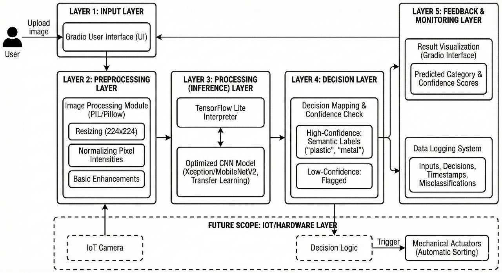

# 🗑️ AI-Based Garbage Classification System for Sustainable Waste Management

An intelligent deep learning–based waste classification system designed to automatically categorize garbage images into multiple waste classes using **transfer learning**, **edge-optimized inference**, and a **user-friendly web interface**. The system supports real-time predictions and is suitable for deployment in smart waste management environments.

---

## 📌 Project Overview

With the rapid growth of urbanization and waste generation, manual waste segregation has become inefficient, error-prone, and unsafe. This project proposes an **AI-powered garbage classification system** that leverages **Convolutional Neural Networks (CNNs)** to automate waste segregation and support sustainable waste management practices.

The system is built using a **pretrained Xception model**, optimized using **TensorFlow Lite** for lightweight deployment, and integrated with a **Gradio-based interface** for easy interaction and visualization.

---

## 🏗️ System Architecture

The proposed system follows a **layered and modular architecture**, ensuring scalability, maintainability, and deployment readiness.

### Architecture Layers:
1. **Input Layer**
   - Accepts waste images uploaded via a Gradio web interface.
2. **Preprocessing Layer**
   - Image resizing to 224×224
   - Pixel normalization
   - Data augmentation and enhancement using PIL/Pillow
3. **Inference Layer**
   - CNN-based classification using pretrained Xception
   - TensorFlow Lite for efficient edge inference
4. **Decision Layer**
   - Confidence-aware prediction handling
   - Low-confidence samples are flagged instead of forcefully classified
5. **Feedback & Monitoring Layer**
   - Displays predictions and confidence scores
   - Logs outputs for performance monitoring and future retraining

---

## 🧠 Model Details

- **Base Architecture:** Xception (transfer learning)
- **Alternative Lightweight Model:** MobileNetV2
- **Pretrained On:** ImageNet
- **Optimizer:** Adam
- **Loss Function:** Categorical Cross-Entropy
- **Inference Engine:** TensorFlow Lite

---

## 📊 Dataset

- **Source:** Public Garbage Classification Dataset (Kaggle)
- **Total Classes:** 12
  - Paper
  - Cardboard
  - Plastic
  - Metal
  - Trash
  - Battery
  - Shoes
  - Clothes
  - Green Glass
  - Brown Glass
  - White Glass
  - Biological Waste

### Data Split:
- **Training:** 70%
- **Validation:** 20%
- **Testing:** 10%

---

## 📈 Experimental Results

- **Overall Test Accuracy:** **92.4%**
- **Evaluation Metrics Used:**
  - Accuracy
  - Precision
  - Recall
  - F1-score

### Key Observations:
- High accuracy for visually distinct classes such as *clothes* and *shoes*
- Lower performance for visually similar materials such as *plastic* and *glass*
- Stable convergence achieved through early stopping and regularization

---

## 🌍 Key Features

- ✔ Real-time waste image classification
- ✔ Edge-compatible inference using TensorFlow Lite
- ✔ Confidence-aware decision logic
- ✔ Modular and scalable architecture
- ✔ User-friendly Gradio web interface

---

## 🚀 Applications

- Smart waste bins
- Automated waste segregation systems
- Smart city infrastructure
- Recycling plants
- Sustainability-focused AI deployments

---

## 🔮 Future Scope

- Integration of multimodal sensors (weight, material sensing)
- Expansion of dataset with real-world waste samples
- Integration with IoT-enabled cameras and actuators
- Fully automated waste segregation pipelines
- Improved handling of visually ambiguous waste classes

---

## 🛠️ Technologies Used

- Python
- TensorFlow / Keras
- TensorFlow Lite
- Gradio
- PIL / Pillow
- NumPy, Pandas, Scikit-learn

---

## 👨‍💻 Authors

- Antriksh Bhadauriya
- Vaibhav Tiwari
- Sneha 
- Ritesh Tiwari

Department of Computer Science & Engineering (Data Science)  
Babu Banarasi Das Institute of Technology and Management, Lucknow, India

---

## 📄 License

This project is intended for **academic and research purposes**.  
Please cite the associated research paper if you use or extend this work.

